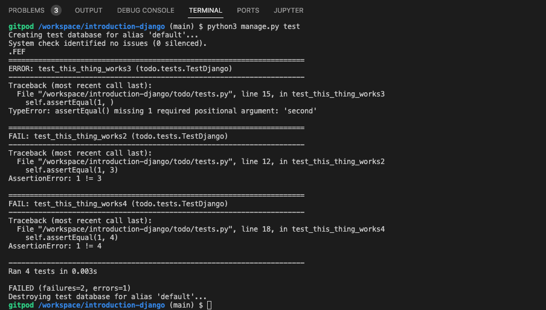

# Introduction Django

## Hello Django Instructions (Full Project)
* Getting Set up
       
   * Part 1: Creating the ‘Say Hello’ App
   * Part 2: Returning a basic HTML Template
   * Part 3: Migrations and Admin
   * Part 4: Models
   * Part 5: Rendering Data
   * Part 6: Rendering a Create New Item page
   * Part 7: Modifying Data
   * Part 8: Testing
   * Part 9: Deployment

A walkthrough project from the Code Institute for the level 5 diploma in web application development - Introduction to Django.

* [Initial Setup of the project](#initial-setup-of-the-project)
  * [Virtual Environments and installing Django](#virtual-environments-and-installing-django)
  * [Creating a Django project](#creating-a-django-project)
  * [Running the project](#running-the-project)
  * [Creating an app](#creating-an-app)
  * [Setting up the Database & Migration commands](#setting-up-the-database--migration-commands)
  * [Models](#models)
  * [Displaying information from the database in a template](#displaying-information-from-the-database-in-a-template)
  * [Creating a new template](#creating-a-new-template)
  * [Form POST & CSRF Tokens](#form-post--csrf-tokens)
* [Django Testing](#django-testing)
* []

## Initial Setup of the project

---

### Virtual Environments and installing Django

For this project I will be using pipenv to create a virtual environment and to install packages.

1. Install Django. For the Code Institute walkthrough it is important to install Django version 4. This is the long term support (LTS) version of Django which makes it preferable to use over the newest version of Django.

``` bash
pip3 install 'django<4'
```

2. A pop-up will ask whether you want to create the virtual environment for the current workspace - click yes.
3. To launch the virtual environment we will then need to run:

``` bash
pip3 shell
```

Once this is complete you will see that there are files and folders in the .venv file and a `pipfile` and `pipfile.lock` in the root. The pipfile is similar to requirements.txt, it lists all the packages installed. You should not make any changes in `pipfile.lock` as this can cause errors.

---

### Creating a Django project

Django comes with a built in admin command we can use to create our project:

``` bash
django-admin startproject PROJECT_NAME .
```

Change the PROJECT_NAME to the name of the project. The dot at the end of the command lets Django know we want to create the project in the current directory.

This will then create two new items, the project directory folder `django_todo` and a `manage.py` file. The project directory will hold:

* `__init.py` - this file tells the project that this is a directory we can import from
* `settings.py` - holds all the global settings for the entire project (e.g. debug settings, where the HTML templates are located and what database to connect to)
* `urls.py` - contains the routing information which allows a user to type a specific URL into their address bar and hit a specific python function (similar to app.route in flask)
* `wsgi.py` - contains the code that allows the web server to communicate with the python application

---

### Running the project

We can run the project using  `manage.py`:

``` bash
python3 manage.py runserver
```

There will be a link in the terminal for the development server. To open it hold `command` + click. A brower tab will open and you should see a message letting you know the install was successful.

When you run the project 2 files will be created, a ``__pycache__`` file will be created in the ``.venv -> bin`` folder, and a ``db.sqlite3`` file will be created in the root.

---

### Creating an app

Django projects are organised into small components called apps. An app is a reuable self-contained collection of code, which allows it to be passed to other projects to speed up developement time. Rather than creating your own authentication system, you can use a Django app and install it into your project. Apps are an integral part of Django and are created using the following command:

``` bash
python3 manage.py startapp APP_NAME
```

---

### Setting up the Database & Migration commands

Migrations are Django's was of converting python code into database operations. So when you need to make changes to a database connected to a Django project, instead of running the SQL commands (or any other type of database language) Django will do this for you and all we need to do is write the python code.

When we first create a project, Django will remind us in the terminal that there are unapplied migrations - it is telling us that we have not done the initial set-up of the database.

* Using the `--dry-run` flag to check what migrations are required without creating the migration: 

  ``` bash
  python3 manage.py makemigrations --dry-run
  ```

* To show all migrations in a project that need to be applied (this includes built-in apps such as authentication and admin. By applying these migrations we will set up the database and it will then allow us to create an admin user that we can use to manage it):

  ``` bash
  python3 manage.py showmigrations
  ```

* Using the `--plan` flag on migrate to see what the migration will do:

  ``` bash
  python3 manage.py migrate --plan
  ```

* To run a migration(this tells Django to convert the python code to SQL to execute on the database):

  ``` bash
  python3 manage.py migrate
  ```

*  Creating the admin superuser -This is used to log in and look at the tables in the database, and make changes to them if needed: 

  ```
  python3 manage.py createsuperuser
  ```

  This command will then prompt you to enter a username, an email and a password.

  To log in with this admin superuser credential we need to run the project and then navigate to /admin in the browser. Once logged in we should be able to see authentication and authorisation app and the two tables created inside that app (Groups and Users). You should be able to find the superuser in the users table.

  ### Models

The models are what define the database schema. They are how we define the table headings.

Class inheritance is very important - it means we can pull in the functionality from one class to another by using class inheritance.

If we want to create a table with the fields id, name and status - we don't need to worry about the id field as Django will create this for us automatically.

To create the table in the database we will need to use the command below to create a migrations file:

`python3 manage.py makemigrations`

(It would be a good idea to check what is going to migrate using the `--dry-run` flag if you are not confident on what the migration will do). Django will then create a new python file in migrations folder which contains the code on how to create the database table based on the model. Django will convert this code to SQL and executed on the database when we run the migration.

We can use the `python3 manage.py showmigrations` command to see what migrations are unapplied - to run then we just need to run `python3 manage.py migrate` (again we can use the `--plan` flag if we want to double check what the planned migrations are before running the migration).

We won't be able to see these items in the admin until we expose them. We can do that by registering our model in the todo apps admin.py file. First we will import the Item from the .models and then we can use the admin.site.register function to register the model.

The Items will then appear in the todo section of the administration panel. We can then click this and it will take us to the page where we can add items - click the add items button and then fill in the form. The items will then be created and display in a list on the items page. 

To make the items have a nicer display name (currently the items are using the built-in string from the base models class which displays the class name followed by the word object) we need to override this method with our own by redefining the string in our own class.

### Displaying information from the database in a template

In the model, view template design pattern - the models create the tables in the database and the views allow the users to interact with the information in the database through the templates.

So in order to allow the users to be able to interact with the information in the database we will need to import the Item model and this will allow us to use the item model in the views. 

We can then create a variable in the function which will hold a query set of all the items in the database. Finally we can create another variable which will be a dictionary with all our items in it. This variable will be added to the render function as the third argument to allow us access to it.

Django is very similar to jinja - we can display using a template variable `{{ }}` (this can be used for almost all the things you can use in python) and we can use `` for functionality such as for loops to iterate through lists etc.

We can also add a message to display if the database is empty using `` before our closing `` This will display whatever is placed in the code if the database is empty.

### Creating a new template

When creating a new template we need to make sure that we add this to the views.py by creating a new function for the template. This enables us to be able to render the template in the browser. We will also need to add it to the url patterns in urls.py which will give us a url to the page (make sure to also import it in the views import section).

when creating links to other templates in Django we use the name we assign in the path.

### Form POST & CSRF Tokens

Whenever we use the POST method on a form in Django we need to add a cross-site request forgery token (CSRF)  - `` - just after the opening form tag. This token is a randomly generated unique value that is added to the form as a hidden input field when the form is submitted. Its purpose is to ensure the data that is being posted is coming from our app and not some other website.

If this is omitted from the form, Django will throw an error on submission as it won't be able to guarantee that the post data is coming from the correct source.

---

## Django Testing

When we create an app, Django will automatically create a `tests.py` file which imports the class TestCase from django.test. This class is an extension of the Python standard library module called unit tests and will provide us with a bunch of methods to assert various things about our code (such as assert equal, assert true, assert false etc).

We need to create a class called TestDjango which will inherit the built-in test case class, this will give us access to all its functionality. Within this class every new test will be defined as a method that begins with the word test. We pass in self as a parameter (self refers to the TestDjango class, because it inherits the TestCase class we'll have a selection of pre-built methods and functionalities that we will be able to use, like assertEqual.) Make sure the test name is something that makes it easy to see what the issue is if the test fails.

To perform the test we can run the following command in the terminal:

``` bash
python3 manage.py test
```

The image below shows the output for a failed test (the test was checking if 0 was equal to 1). 

At the top is an `F` which tells us this test failed. Beneath that it will tell us which test failed and why. At the bottom is a summary letting us know how many tests were run, how long it took and how many failures there were.


The image below shows the output for a passing test (it will be shown as a `.`), and a test containing an error (shown as an `E`).



We can seperate our testing logic, which will make it more organised and easier to manage, as well as allowing us to make our tests more independent of one another. We do this by renaming the `tests.py` file to `test_views.py`. We can then use this file to run all our views testing. We can also create a file to test our models (`test_models.py`), and our forms (`test_forms.py`).

We can also be specific about which tests are run (as by default Django will try to run all tests). We do this by adding the app and test file at the end:

``` bash
python3 manage.py test todo.test_forms
```

We can also add a specific class to the end of the test command if we only want to run a specific test:

``` bash
python3 manage.py test todo.test_forms.TestItemForm
```

or even a specific test by adding the test name onto the end of the test command:

``` bash
python3 manage.py test todo.test_forms.TestItemForm.test_fields_are_explicit_in_form_metaclass
```

### Coverage

To find out how much of our code we have tested we can use a tool called coverage. To install:

```bash
pip3 install coverage
```

To run:

``` bash
coverage run --source=todo manage.py test
```

To view the report:

```bash
coverage report
```

This will create a report that gives us a percentage of the code that has been covered by testing. To see the parts that we are missing, we can create an interactive HTML report:

```bash
coverage html
```

By running this command we will have created a new folder in our project called `htmlcov`. Inside it is an index.html file - to view this we can use the following command (otherwise Django will try looking for it with a URL that doesn't exist):

```bash
python3 -m http.server
```

We will then need to open the htmlcov folder which will automatically open the index.html page. This will then display an interactive report that we can click on to get further information.

NOTE: 100% coverage does not mean that all tests have passed - make sure to keep an eye on the results when testing.

It is unlikely to always reach 100% Total coverage, as there are files that are generated by Django that we should not adjust. We just need to make sure we are testing our own code.

## Deploying to Heroku

**NOTE** 

This section needs updating to use ElephantSQL rather than postgres add-on in heroku

### Updating the Database

While in deployment we have been using a development database, but this can't be used with Heroku. We will therefore need to use an add-on for heroku to allow us to use a Postgres database. We want to use postgres as it is a server based database which is preferable to herokus database which is ephemeral file system (this means it is wiped and rebuilt). By using a server based database it will survive even if the application server is destroyed.

To use postgres we need to install the package psycopg2 using the following command:

``` bash
pip3 install psycopg2-binary
```

We will also need a package called gunicorn (also known as green unicorn). This will replace our development server once the app is deployed to Heroku. It will act as our web server. To install:

```bash
pip3 install gunicorn
```

Note: When we use pipenv the dependencies are automatically updated in our pipfile, so we don't need to create a requirements.txt file, as the pipfile does the same thing.

### Using the postgres add-on in heroku

Go to resources tab in the app and search for postgres. Leave the hobby Dev selected and then complete order. If we then go into the settings and click the reveal config vars button we can see a URL for the postgres database has been created for us to use to connect our app to.

### Setting the Django app up

We will need to install a package called dj-database-url to connect to our remote database:

```bash
pip3 install dj_database_url
```

This package allows us to parse the the database URL heroku created and get all the connection information out of it.

We can get the URL from settings on heroku or we can use the terminal - `heroku config` this allows us to get, edit, set and unset environment variables for our apps.

Open settings.py and import dj_database_url so that we can use it. Then look for the databases setting. Copy it and paste it underneath, then comment out the original one. We then want to delete everything after default and replace it with `dj_database_url.parse()` we will then copy and paste the database URL into the parentheses.

Next we will need to run migrations to get the database set up using the models etc we already have.

```bash
python3 manage.py migrate
```